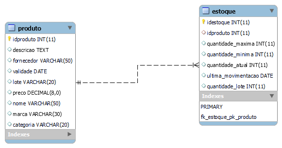

# Estudo de caso
## Casa Oliveira

Roberto é dono de um mercado no bairro de Vargem Grande, na cidade de Tupã. Ele herdou o negócio de seu pai, Gumercindo Oliveira, ela foi aberta em 1978 na garagem da casa da família, era uma pequena quitanda. Com o passar dos anos o negócio cresceu e Gumercindo foi obrigado a ir para outro ponto maior e ali permaneceu até os dias atuais.

Roberto, que agora é o novo dono do mercado continuou o negócio seguindo da mesma forma que o pai. Ele comprava diretamente com os fornecedores grandes volumes de produtos e armazenava em seu estoque. As vezes ele comprava muitos produtos que ainda havia em estoque causando uma sobrecarga de produtos, ele também tinha muitos produtos estragados, tais como: frutas, legumes, iogurtes, leites, frango, etc. Também havia muitos produtos com o prazo de validade vencido.

Os funcionários eram poucos e faziam muitas coisas ao mesmo tempo. O açougueiro também ajudava no estoque, a moça da limpeza ajudava na organização dos produtos das prateleira, além de ajudar na padaria, quanto o caixa estava vazio o operador ajudava a repor os laticínios e a limpar a loja. O repositor também fazia operação no caixa.

Ao realizar a venda o Roberto, que sabia o nome de quase todos os clientes, anotava em um caderno todos os produtos que vendia e que havia em estoque. Ao fim do dia , Roberto pegava o caderno de fazia os cálculos de o quanto havia vendido, somando o faturamento e realizando a atualização do estoque. Isso é feito todos os dias e tomava um tempo considerável para que tudo tenha sido feito.

Roberto fechava a loja as 18h, mas só ia para casa as 22h, após fazer todas as operações necessárias. Mesmo assim o negócio vai bem e Roberto pretende ir para outro ponto e aumentar o volume de negócios e contratar novos funcionários.

Marica, esposa de Roberto, vem conversando com ele há muito tempo para que ele contrate uma empresa para construir um sistema de informática para gerenciar o negócio e reduzir o tempo que ele passa trabalhando e tenha maior organização dos produtos, maior lucratividade e melhorar a gestão.

Com a intenção de aumentar o negócio, Roberto está disposto a informatizar sua empresa. Vamos ajudá-lo. Iremos começar construindo o banco de dados.

### Problemas a se solucionar:
- Gerenciamento do estoque;
- Falta de funcionários;
- Funcionário desempenhando várias funções;
- Fluxo de caixa:(Entrada | saída de valores)
- Baixar no estoque;
- Gestão de patrimônio: Computadores, prateleiras, geladeira, fogão, carrinho, caixas, balcões
Padaria e açougue, balanças, etc...;
- setor de compras.
- setor financeiro;


## 1 - Gestão do Estoque
	- informações sobre os produtos(validade, valor, lote, nome, descrição, marca, idproduto, categoria, fornecedor)
	volume de produtos em estoque(quantidade_atual, 
	quantidade_lote, ultima_movimentação, quantidade_maxima, quantidade_minima, idproduto)

## 2 - Funcionário
	informações(nome, função|cargo, salario, matricula, cpf, rg, telefone, email, estado civil,
	Admissão, data nascimento, endereço, usuário, senha, idfuncionário)

## 3 -fluxo de caixa
	forma_pagamento, limite_sagria, valor,	entrada|saída, registro_venda)

## 4 -Gestão de Patrimônio
	Informação_patrimonio(idpatrimonio, códigopatrimonio, descição, valor, nome,setor_pertencente, data_aquisicao, setor_responsavel, data_baixa)

## 5 -setor compras
	Informação_compras(idcompra, funcionário, valor_pag_produto, fornecedor, data_compra, numero_nota_fiscal, nome_produto, descrição, consumível, quantidade, setor_destino)

## 6 -setor financeiro
	Informação_financeiro(idfinanceiron, lucro, disponibilidade_cofre, valor, tipo_valor, descrição, data_operacao, identificação_responsavel )


## modelo conceitual

#### Modelagem conceitual

# Gerenciar estoque


### Modelo Lógico


---
### Modelo fisico

Codigo e documentaçao do modelo fisico

/*
para o projeto de banco de dados da casa oliveira será criado
uma estrutura fisica com os comando SQL(structure query Language)
Iremos começar com o comando de criação de banco de dados. Este
comando pertence a categoria de comando DDL(Data Definition Languagem)
comando:
	CREATE DATABASE nome_do_banco -> CREATE DATABASE casaioliveira
*/

CREATE DATABASE casaoliveira;
/*
Após a criaçao do banco de dados, é necessário seleciona-lo. para isso
iremos usar o comando USE nome_do_bancodedados
*/
USE casaoliveira;

/*
criação das entidades em modo fisico usando os comando SQL.
para criar um tabela(entidade), usaremos o comando
CREATE TABLE nome_da_tabela seguido por parenteses e os
atritubos(cambos) da tabela, bem como a sua tipificação ,ou seja,
devemos dizer qual o tipo de dados que cada campo(atributo) da
tabela deve receber. EX.: o campo idade deve receber valores
numéricos e, portanto será definido como int(inteiro).
```
vamos criar a tabela de profutos. esta tabela possui os seguintes campos:
	- idprodutos, descrição, fornecedor, validade, lote, preço, nome, marca, categoria
    para cada será definido um tipo de dado
    para o idproduto, iremos definir como:
		-chave-primaria(primary key) é nosso campo indexador, por ele será
        relizado o relacionameto como outras tabelas
        -vamos definir este campo com auto_incremente, o que permite gerar
        os ids de forma automatica. esse passo e importe, pois elemina algums problemas,
        tais como: Concorrencia, geração incrementada de valores e exlusividade
        de valores;
        -vamos definin o campo o tipo de dado numérico int(inteiro)
```
	para o campo descricao, usaremos o tipo de dado text. com este tipo podemos inserir
	ate 64mil caracteres. como neste campo pode haver a possibilidade de um descricao
	longa do produto, se faz necessario um tamanho maior.
```
	para o campo fornecedor iremos usar o tipo de dado VARCHAR. este tipo de dado nos permite
	inserir textos, mais com um limite que pode ser pre definido pelo usuário ou podemos utilizar
	o limite total de 255 caracter. para o fornecedor, usaremos 50 caracteres.
```
	para o campo validade iremos usar o tipo de dados DATE.alter
```
	para o campo lote será definido o tipo de dado VARCHAR, pois há a possibilidade de valor conter
	caracteres alfadecimais. sendo assim, o VARCHAR é uma otima opcao por aceitar valores diversos.alter
```
	o campo preco será definido como DECIMAL. com esse tipo e possivel inserir valores numericos
	com e aplicaçao de casas decimais. voce define o comprimento e deste tamnho e configurado as casas decimais.EX.: DECIMAL(10,2)	-> comprimeito de 10 digito e destes temos 2 casas decimal
	veja: R$ 11111111,11  -> R$ 11.111.111,11
```
	para os campos nome, marca e categoria será definido o tipo de dado VARCHAR, pois este tipo
	é capaz de receber caracterer de texto. presaremos, apenas definir, o tamanho de cada campo.
	EX.: nome pode ficar com o tamanho 50, marca ficar com 30 e categoria 20
```
## Linguagem SQL
```
	*/
	CREATE TABLE produto(
	idproduto int auto_increment primary key,
	descricao text,
	fornecedor varchar(50),
	validade date,
	lote varchar(20),
	preco decimal(8.2),
	nome varchar(50),
	marca varchar(30),
	categoria varchar(20)
	);
```
	CREATE TABLE estoque(
	idestoque int auto_increment primary key,
	idproduto int,
	quantidade_maxima int,
	quantidade_minima int,
	quantidade_atual int,
	ultima_movimentacao date,
	quantidade_lote int
	);

### Modelo fisico - MER(Modelo de Entidade Relacional)

